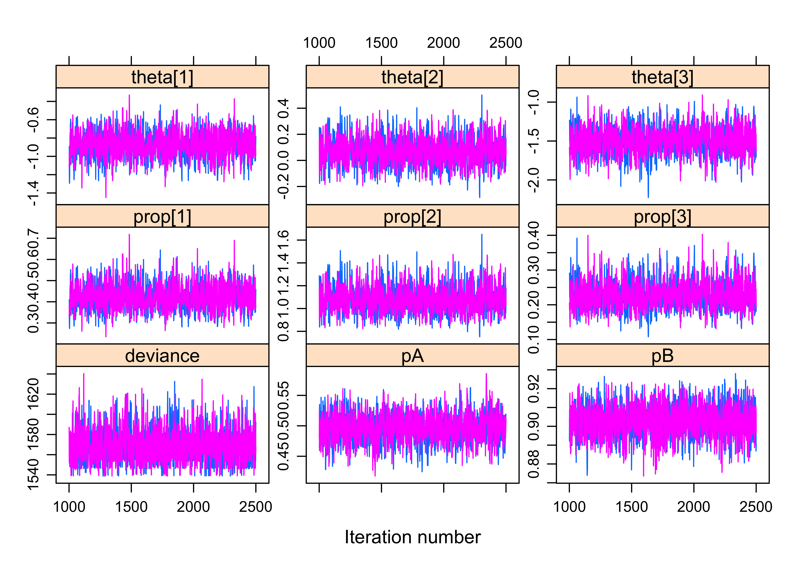
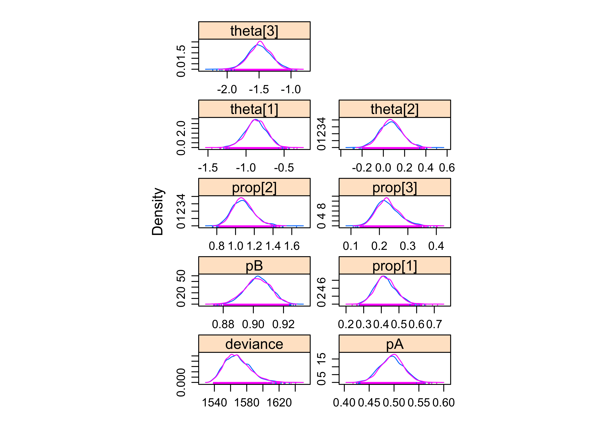
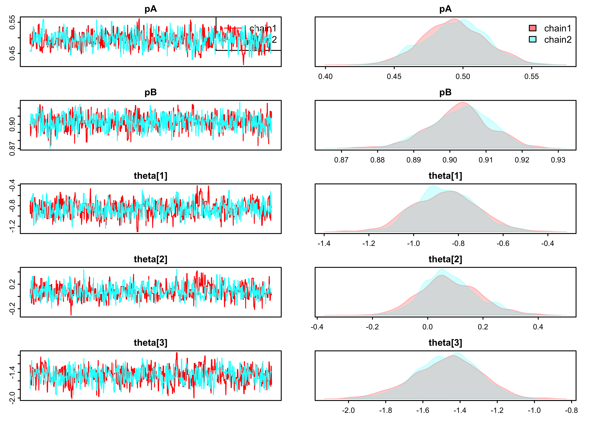

# Simulate data and fit 2-species occupancy model à la Rota et al. (2016) w/ Jags and Nimble

We consider a two-species static occupancy model à la [Rota et al. (2016)](https://besjournals.onlinelibrary.wiley.com/doi/full/10.1111/2041-210X.12587). We simulate data from this model, and fit the model to these data using `Jags` and `Nimble`.
The equations below do no display well, you'd rather have a look to the [PDF file](https://github.com/oliviergimenez/bayes2speciesoccupancy/blob/master/simul_rota.pdf). With the [Rmd file](https://github.com/oliviergimenez/bayes2speciesoccupancy/blob/master/simul_rota.Rmd), you can run the code in RStudio and reproduce the results.

Rota and colleagues used `Stan` and we refer to the supplementary material of their paper for further details. Fidino and colleagues extended the Rota's model to multiple seasons, therefore allowing the estimation of local colonization and extinction (dynamic models), and they used `Jags', check out their paper [here](https://besjournals.onlinelibrary.wiley.com/doi/abs/10.1111/2041-210X.13117) and the code [there](https://github.com/mfidino/dcom).

## Setting the scene

Ignoring the site index, we use the following notation for the occupancy probabilities:

* $\psi_{11}$ is the prob. that species 1 and species 2 are both present;  
* $\psi_{10}$ is the prob. that species 1 is present and species 2 is absent;
* $\psi_{01}$ is the prob. that species 1 is absent and species 2 is present;
* $\psi_{00}$ is the prob. that species 1 and species 2 are both absent,
with avec $\psi_{11} + \psi_{10} + \psi_{01} + \psi_{00} = 1.$

The marginal probabilities of occupancy are:

* $\Pr(z_1 = 1) = \Pr(\mbox{species 1 is present}) = \psi_{10} + \psi_{11}$
* $\Pr(z_2 = 1) = \Pr(\mbox{species 2 is present}) = \psi_{01} + \psi_{11}$
* $\Pr(z_1 = 0) = \Pr(\mbox{species 1 is absent}) = \psi_{01} + \psi_{00}$
* $\Pr(z_2 = 0) = \Pr(\mbox{species 2 is absent}) = \psi_{10} + \psi_{00}$

And the conditional probabilities (reminder: $\Pr(\mbox{A|B}) = \Pr(\mbox{A and B})/\Pr(\mbox{B})$):

* $\Pr(z_1 = 1 | z_2 = 0) = \psi_{10} / (\psi_{10} + \psi_{00}) = \Pr(\mbox{species 1 is present given species 2 is absent});$
* $\Pr(z_1 = 1 | z_2 = 1) = \psi_{11} / (\psi_{11} + \psi_{01}) = \Pr(\mbox{species 1 is present given species 2 is present});$
* $\Pr(z_2 = 1 | z_1 = 0) = \psi_{01} / (\psi_{01} + \psi_{00}) = \Pr(\mbox{species 2 is present given species 1 is absent});$
* $\Pr(z_2 = 1 | z_1 = 1) = \psi_{11} / (\psi_{11} + \psi_{10}) = \Pr(\mbox{species 2 is present given species 1 is present}).$

## Data simulation

We will use the package `mipfb` to simulate occupancy state as a multivariate Bernoulli random variable; more about the multivariate Bernoulli can be found in [Dai et al. (2013)](https://arxiv.org/pdf/1206.1874.pdf):

```r
library(mipfp)
```

For reproducibility, we set the seed:

```r
set.seed(2020) 
```

Choose the number of species, the number of sites, and the number of visits: 

```r
S <- 2 # nb species 
N <- 500 # nb sites
J <- 5 # nb visits
```

Let's consider a scenario in which species 2 avoids species 1 while species 1 does not care about species 2 and its presence or absence. To specify this scenario, we will work out the conditional probabilities with, for example:

* $\Pr(z_2 = 1 | z_1 = 0) = 0.6$, species 2 is present with high probability whenever species 1 is absent
* $\Pr(z_2 = 1 | z_1 = 1) = 0.1$, species 2 avoids species 1 when it is present
* $\Pr(z_1 = 1 | z_2 = 0) = \Pr(z_1 = 1 | z_2 = 1) = 0.4$, species 1 does not care about presence/absence of species 2

Now we need to go back to the probabilities of occupancy. Let $x = \psi_{01}$, $y = \psi_{10}$ et $z = \psi_{11}$ soit $1 - x - y - z = \psi_{00}$, then we have a system of 3 equations with 3 unknowns:

$$0.6 = x / (x + 1 - x - y - z) \Leftrightarrow x + 0.6y + 0.6z = 0.6$$
$$0.1 = z / (z + y) \Leftrightarrow -0.1y + 0.9z = 0$$
$$0.4 = y / (y + 1 - x - y - z) \Leftrightarrow 0.4x + y + 0.4z = 0.4$$

which can be solved with the [Mathematica online solver](https://www.wolframalpha.com/input/?i=solve%7Bx%2B0.6y%2B0.6z%3D%3D0.6%2C-0.1y%2B0.9z%3D%3D0%2C0.4x%2By%2B0.4z%3D%3D0.4%7D): 

```r
psi01 <- 81/175
psi10 <- 36/175
psi11 <- 4/175
psi00 <- 1 - (psi01 + psi10 + psi11) # 54/175
```

We then obtain the marginal occupancy probabilities:

```r
psiS1 <- psi10 + psi11
psiS2 <- psi01 + psi11
```

Now we're ready to simulate data from a multivariate Bernoulli (check out `?RMultBinary` and `?ObtainMultBinaryDist`).

First, we calculate the odds ratios:

```r
or <- matrix(c(1, (psiS1*(1-psiS2))/(psiS2*(1-psiS1)), 
               (psiS2*(1-psiS1))/(psiS1*(1-psiS2)), 1), nrow = 2, ncol = 2, byrow = TRUE)
rownames(or) <- colnames(or) <- c("sp1", "sp2")
```

Then the marginal probabilities:

```r
marg.probs <- c(psiS1, psiS2)
```

And we estimate the joint probability:

```r
p.joint <- ObtainMultBinaryDist(odds = or, marg.probs = marg.probs)
```

At last, we generate $N$ random samples from a bivariate Bernoulli (2 species) with relevant parameters

```r
z <- RMultBinary(n = N, mult.bin.dist = p.joint)$binary.sequences 
```

Now we add on top the observation. First, we fix the detection probability for each species:

```r
ps <- c(0.5,0.9)
```

Then we generate the detection and non-detections for each species, which we store in a list: 

```r
y_unmarked <- list()
for (i in 1:S){
  y_unmarked[[i]] <- matrix(NA,N,J)
  for (j in 1:N){
    for (k in 1:J){
      y_unmarked[[i]][j,k] <- rbinom(1,1,z[j,i]*ps[i])
    }
  }
}
names(y_unmarked) <- c('sp1','sp2')
```

Let's format the data in a matrix with $N$ rows (sites) and $J$ columns (surveys) with in each cell a `1`, `2`, `3` or `4` for the observation (or event in the capture-recapture terminology) `none species detected`, `species 1 detected`, `species 2 detected` or `both species detected`:

```r
y_jags <- matrix(NA, nrow = N, ncol = J)
for (j in 1:N){
  for (k in 1:J){
    if (y_unmarked[[1]][j,k] == 0 & y_unmarked[[2]][j,k] == 0) y_jags[j,k] <- 1
    if (y_unmarked[[1]][j,k] == 1 & y_unmarked[[2]][j,k] == 0) y_jags[j,k] <- 2
    if (y_unmarked[[1]][j,k] == 0 & y_unmarked[[2]][j,k] == 1) y_jags[j,k] <- 3
    if (y_unmarked[[1]][j,k] == 1 & y_unmarked[[2]][j,k] == 1) y_jags[j,k] <- 4
  }
} 
head(y_jags, 25)
```

```
##       [,1] [,2] [,3] [,4] [,5]
##  [1,]    1    1    1    1    1
##  [2,]    1    1    1    1    1
##  [3,]    1    1    1    1    1
##  [4,]    3    3    3    3    3
##  [5,]    3    3    1    3    3
##  [6,]    1    1    1    1    1
##  [7,]    4    3    4    4    3
##  [8,]    1    1    1    1    1
##  [9,]    1    2    2    2    2
## [10,]    4    4    3    3    4
## [11,]    1    1    1    1    1
## [12,]    1    1    1    1    1
## [13,]    4    3    4    2    3
## [14,]    3    3    3    3    3
## [15,]    2    4    4    4    4
## [16,]    1    1    1    1    1
## [17,]    1    1    1    1    1
## [18,]    3    4    4    3    2
## [19,]    3    3    3    3    3
## [20,]    3    3    1    3    3
## [21,]    1    1    2    2    1
## [22,]    1    1    1    1    1
## [23,]    3    3    3    3    3
## [24,]    3    3    3    3    3
## [25,]    1    1    1    1    1
```

## Model fitting with `Jags`

Now let us fit a 2-species static occupancy model to the data we have simulated. We need to load the package `R2jags`:

```r
library(R2jags)
```

We specify our model in BUGS language. In the model developed by Rota and colleagues, it is assumed that the detection of a species is independent of the presence or absence of the other species; if it is thought otherwise, check out Equation 5 in [Fidino et al. (2019)](https://besjournals.onlinelibrary.wiley.com/doi/abs/10.1111/2041-210X.13117). To specify the occupancy probabilities, we use a multinomial logit link (e.g. [Guéry et al. 2019](https://onlinelibrary.wiley.com/doi/full/10.1002/ece3.4827)). 

```r
model <- function() { 
  
## state process
for(j in 1:nsite) {
  z[j] ~ dcat(psi[1:4])
}

# occupancy probabilities
psi[1] <- 1 / (1 + sum(prop[1:3])) # unoccupied
psi[2] <- prop[1] / (1 + sum(prop[1:3])) # occupied by species A and not B
psi[3] <- prop[2] / (1 + sum(prop[1:3])) # occupied by species B and not A
psi[4] <- prop[3] / (1 + sum(prop[1:3])) # occupied by both species A and B

## observation process
for(j in 1:nsite) {
  for(k in 1:nyear) {
      y[j, k] ~ dcat(obs[1:4,z[j]])
  }
}

# detection matrix with obs for observations and state = true states
# obs take values:
# 1 for none species detected
# 2 for species 1 detected
# 3 for species 2 detected
# 4 for both species detected
# given state = unoccupied,
obs[1, 1] <- 1 # prob obs = 1 
obs[2, 1] <- 0 # prob obs = 2
obs[3, 1] <- 0 # prob obs = 3
obs[4, 1] <- 0 # prob obs = 4
# given state = occupied by species A and not B,
obs[1, 2] <- 1 - pA # prob obs = 1
obs[2, 2] <- pA # prob obs = 2
obs[3, 2] <- 0 # prob obs = 3
obs[4, 2] <- 0 # prob obs = 4
# given state = occupied by species B and not A,
obs[1, 3] <- 1 - pB # prob obs = 1
obs[2, 3] <- 0 # prob obs = 2
obs[3, 3] <- pB # prob obs = 3
obs[4, 3] <- 0 # prob obs = 4
# given state = occupied by both species A and B,
obs[1, 4] <- (1 - pA) * (1 - pB) # prob obs = 1
obs[2, 4] <- pA * (1 - pB) # prob obs = 2
obs[3, 4] <- (1 - pA) * pB # prob obs = 3
obs[4, 4] <- pA * pB # prob obs = 4

## priors for...
# occupancy probabilities
for (i in 1:3){
log(prop[i]) <- theta[i]
theta[i] ~ dnorm(0,1) 
}
# detection probabilities
pA ~ dunif(0,1) 
pB ~ dunif(0,1) 
}
```

Specify data, initial values, parameters to be monitored and various MCMC details:

```r
# data
data <- list(y = y_jags, 
                 nsite = dim(y_jags)[1], 
                 nyear = dim(y_jags)[2])

# initial values
zinit <- rep(NA, data$nsite) # use the simulated z values as initial values
for(i in 1:data$nsite){
    if (z[i,1] == 0 & z[i,2] == 0) zinit[i] <- 1
    if (z[i,1] == 1 & z[i,2] == 0) zinit[i] <- 2
    if (z[i,1] == 0 & z[i,2] == 1) zinit[i] <- 3
    if (z[i,1] == 1 & z[i,2] == 1) zinit[i] <- 4
}
inits <- function() {list(z = zinit, 
                          pA = runif(1,0,1), 
                          pB = runif(1,0,1), 
                          theta = rnorm(3, 0, 1))}

# parameters monitored
params <- c("prop","theta","pA","pB")

# MCMC settings
ni <- 2500
nb <- 1000
nc <- 2
```

Run `Jags` from `R`:

```r
ptm <- proc.time()
out <- jags(data = data, 
            inits = inits, 
            parameters.to.save = params, 
            model.file = model, 
            n.chains = nc, 
            n.iter = ni, 
            n.burnin = nb)
```

```
## Compiling model graph
##    Resolving undeclared variables
##    Allocating nodes
## Graph information:
##    Observed stochastic nodes: 2500
##    Unobserved stochastic nodes: 505
##    Total graph size: 3530
## 
## Initializing model
```

```r
x <- proc.time() -  ptm
x
```

```
##    user  system elapsed 
##  19.428   0.030  19.474
```

Check convergence:

```r
jagsfit.mcmc <- as.mcmc(out)
library(lattice)
xyplot(jagsfit.mcmc, layout=c(3,3))
```

<!-- -->
                                                   
Posterior densities:

```r
densityplot(jagsfit.mcmc)
```

<!-- -->

Print results:

```r
print(out,digits = 3)
```

```
## Inference for Bugs model at "/var/folders/r7/j0wqj1k95vz8w44sdxzm986c0000gn/T//RtmpeRYASE/model56783ad1b222.txt", fit using jags,
##  2 chains, each with 2500 iterations (first 1000 discarded)
##  n.sims = 3000 iterations saved
##           mu.vect sd.vect     2.5%      25%      50%      75%    97.5%  Rhat
## pA          0.496   0.023    0.450    0.480    0.496    0.512    0.541 1.002
## pB          0.903   0.008    0.886    0.897    0.903    0.909    0.919 1.003
## prop[1]     0.423   0.059    0.314    0.383    0.420    0.460    0.544 1.003
## prop[2]     1.081   0.113    0.880    1.003    1.072    1.151    1.333 1.005
## prop[3]     0.229   0.040    0.160    0.201    0.225    0.254    0.316 1.005
## theta[1]   -0.869   0.139   -1.157   -0.959   -0.868   -0.776   -0.609 1.003
## theta[2]    0.073   0.103   -0.128    0.003    0.070    0.140    0.288 1.005
## theta[3]   -1.490   0.174   -1.832   -1.605   -1.491   -1.371   -1.152 1.005
## deviance 1568.868  15.667 1542.606 1556.678 1567.653 1579.276 1604.105 1.001
##          n.eff
## pA         890
## pB         740
## prop[1]    660
## prop[2]   2000
## prop[3]    880
## theta[1]   660
## theta[2]  2000
## theta[3]   880
## deviance  3000
## 
## For each parameter, n.eff is a crude measure of effective sample size,
## and Rhat is the potential scale reduction factor (at convergence, Rhat=1).
## 
## DIC info (using the rule, pD = var(deviance)/2)
## pD = 122.8 and DIC = 1691.6
## DIC is an estimate of expected predictive error (lower deviance is better).
```

Get posterior medians of relevant parameters and compare to the values we used to simulate the data:

```r
# occupancy
prop1 <- c(out$BUGSoutput$sims.array[,,'prop[1]'])
prop2 <- c(out$BUGSoutput$sims.array[,,'prop[2]'])
prop3 <- c(out$BUGSoutput$sims.array[,,'prop[3]'])
psi1 <- plogis(prop1) / (1 + plogis(prop1) + plogis(prop2) + plogis(prop3))
psi2 <- plogis(prop2) / (1 + plogis(prop1) + plogis(prop2) + plogis(prop3))
psi3 <- plogis(prop3) / (1 + plogis(prop1) + plogis(prop2) + plogis(prop3))

# detection
p1 <- c(out$BUGSoutput$sims.array[,,'pA'])
p2 <- c(out$BUGSoutput$sims.array[,,'pB'])

# res
res <- data.frame(par_sim = c(psi00,
                              psi10, 
                              psi01, 
                              psi11,
                              ps), 
                  post_median = c(1-(median(psi1)+median(psi2)+median(psi3)),
                                median(psi1), 
                                median(psi2), 
                                median(psi3),
                                median(p1),
                                median(p2)))
rownames(res) <- c('psi00','psi10','psi01','psi11','p1','p2')
round(res,3)
```

```
##       par_sim post_median
## psi00   0.309       0.344
## psi10   0.206       0.208
## psi01   0.463       0.256
## psi11   0.023       0.192
## p1      0.500       0.496
## p2      0.900       0.903
```

## Model fitting with `Nimble`

If you're not familiar with `Nimble`, it is the new kid on the Bayesian block, try it, it's awesome! More [here](https://r-nimble.org/); check out the [workshop materials](https://github.com/nimble-training) in particular, you'll find awesome resources to teach yourself a great tool.

OK, let's start by loading `Nimble`:

```r
library(nimble)
```

Now the code:

```r
code <- nimbleCode({
## state process
for(j in 1:nsite) {
  z[j] ~ dcat(psi[1:4])
}

# occupancy probabilities
psi[1] <- 1 / (1 + sum(prop[1:3])) # unoccupied
psi[2] <- prop[1] / (1 + sum(prop[1:3])) # occupied by species A and not B
psi[3] <- prop[2] / (1 + sum(prop[1:3])) # occupied by species B and not A
psi[4] <- prop[3] / (1 + sum(prop[1:3])) # occupied by both species A and B

## observation process
for(j in 1:nsite) {
  for(k in 1:nyear) {
      y[j, k] ~ dcat(obs[1:4,z[j]])
  }
}

# detection matrix with obs for observations and state = true states
# obs take values:
# 1 for none species detected
# 2 for species 1 detected
# 3 for species 2 detected
# 4 for both species detected
# given state = unoccupied,
obs[1, 1] <- 1 # prob obs = 1 
obs[2, 1] <- 0 # prob obs = 2
obs[3, 1] <- 0 # prob obs = 3
obs[4, 1] <- 0 # prob obs = 4
# given state = occupied by species A and not B,
obs[1, 2] <- 1 - pA # prob obs = 1
obs[2, 2] <- pA # prob obs = 2
obs[3, 2] <- 0 # prob obs = 3
obs[4, 2] <- 0 # prob obs = 4
# given state = occupied by species B and not A,
obs[1, 3] <- 1 - pB # prob obs = 1
obs[2, 3] <- 0 # prob obs = 2
obs[3, 3] <- pB # prob obs = 3
obs[4, 3] <- 0 # prob obs = 4
# given state = occupied by both species A and B,
obs[1, 4] <- (1 - pA) * (1 - pB) # prob obs = 1
obs[2, 4] <- pA * (1 - pB) # prob obs = 2
obs[3, 4] <- (1 - pA) * pB # prob obs = 3
obs[4, 4] <- pA * pB # prob obs = 4

## priors for...
# occupancy probabilities
for (i in 1:3){
log(prop[i]) <- theta[i]
theta[i] ~ dnorm(0,1) 
}
# detection probabilities
pA ~ dunif(0,1) 
pB ~ dunif(0,1) 
})
```

Specify the constants, data and initial values:

```r
# constants
constants <- list(nsite = dim(y_jags)[1], 
                  nyear = dim(y_jags)[2])

# data
data <- list(y = y_jags)

# initial values
zinit <- rep(NA, constants$nsite) # use the simulated z values as initial values
for(i in 1:constants$nsite){
    if (z[i,1] == 0 & z[i,2] == 0) zinit[i] <- 1
    if (z[i,1] == 1 & z[i,2] == 0) zinit[i] <- 2
    if (z[i,1] == 0 & z[i,2] == 1) zinit[i] <- 3
    if (z[i,1] == 1 & z[i,2] == 1) zinit[i] <- 4
}
inits <- list(z = zinit, 
              pA = runif(1,0,1), 
              pB = runif(1,0,1), 
              theta = rnorm(3, 0, 1))
```

Get ready:

```r
Rmodel <- nimbleModel(code, constants, data, inits)
#Rmodel$calculate()   ## -3276.413
conf <- configureMCMC(Rmodel)
conf$printMonitors()
```

```
## thin = 1: theta, pA, pB
```

```r
conf$printSamplers(byType = TRUE)
```

```
## RW sampler (5)
##   - theta[]  (3 elements)
##   - pA
##   - pB
## categorical sampler (500)
##   - z[]  (500 elements)
```

```r
Rmcmc <- buildMCMC(conf)
Cmodel <- compileNimble(Rmodel)
Cmcmc <- compileNimble(Rmcmc, project = Rmodel)
```

Unleash the power of lov... I mean `Nimble`:

```r
samplesList <- runMCMC(Cmcmc, 2500, 
                       nburnin = 1000,
                       nchains = 2,
                       samplesAsCodaMCMC = TRUE)
```

```
## |-------------|-------------|-------------|-------------|
## |-------------------------------------------------------|
## |-------------|-------------|-------------|-------------|
## |-------------------------------------------------------|
```

Check out convergence:

```r
gelman.diag(samplesList)
```

```
## Potential scale reduction factors:
## 
##          Point est. Upper C.I.
## pA             1.00       1.01
## pB             1.00       1.00
## theta[1]       1.01       1.02
## theta[2]       1.01       1.02
## theta[3]       1.01       1.01
## 
## Multivariate psrf
## 
## 1
```

Visualize traceplots and posterior distributions:

```r
library(basicMCMCplots)
chainsPlot(samplesList)
```

<!-- -->

Compare to the results we got with `Jags`, they are basically the same. 

## R version used


```r
sessionInfo()
```

```
## R version 3.6.2 (2019-12-12)
## Platform: x86_64-apple-darwin15.6.0 (64-bit)
## Running under: macOS Catalina 10.15.4
## 
## Matrix products: default
## BLAS:   /Library/Frameworks/R.framework/Versions/3.6/Resources/lib/libRblas.0.dylib
## LAPACK: /Library/Frameworks/R.framework/Versions/3.6/Resources/lib/libRlapack.dylib
## 
## locale:
## [1] fr_FR.UTF-8/fr_FR.UTF-8/fr_FR.UTF-8/C/fr_FR.UTF-8/fr_FR.UTF-8
## 
## attached base packages:
## [1] stats     graphics  grDevices utils     datasets  methods   base     
## 
## other attached packages:
##  [1] basicMCMCplots_0.2.5 nimble_0.9.0         lattice_0.20-38     
##  [4] R2jags_0.5-7         rjags_4-10           coda_0.19-3         
##  [7] mipfp_3.2.1          numDeriv_2016.8-1.1  Rsolnp_1.16         
## [10] cmm_0.12            
## 
## loaded via a namespace (and not attached):
##  [1] igraph_1.2.5     Rcpp_1.0.4       knitr_1.28       magrittr_1.5    
##  [5] R6_2.4.1         rlang_0.4.5      stringr_1.4.0    tools_3.6.2     
##  [9] parallel_3.6.2   grid_3.6.2       xfun_0.12        htmltools_0.4.0 
## [13] R2WinBUGS_2.1-21 yaml_2.2.1       abind_1.4-5      digest_0.6.25   
## [17] codetools_0.2-16 evaluate_0.14    rmarkdown_2.1    stringi_1.4.6   
## [21] compiler_3.6.2   boot_1.3-23      truncnorm_1.0-8  pkgconfig_2.0.3
```
